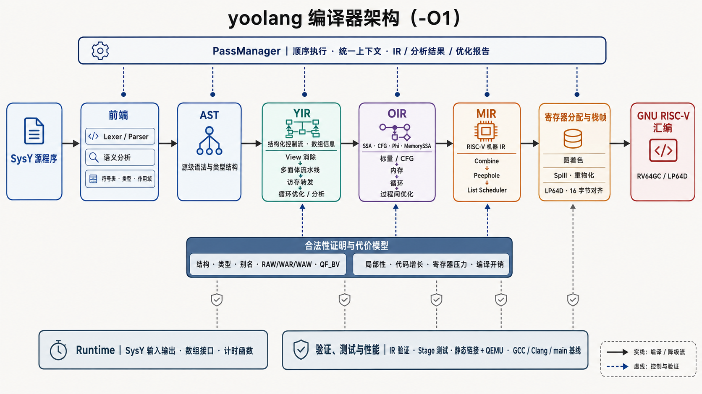
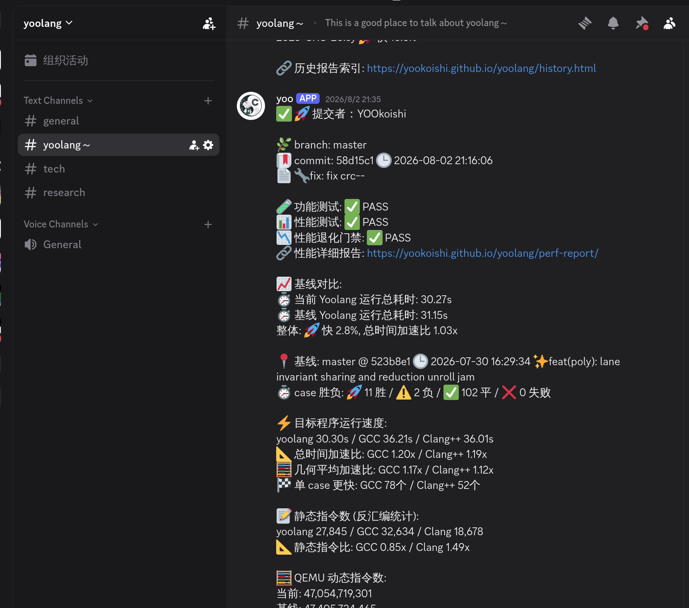
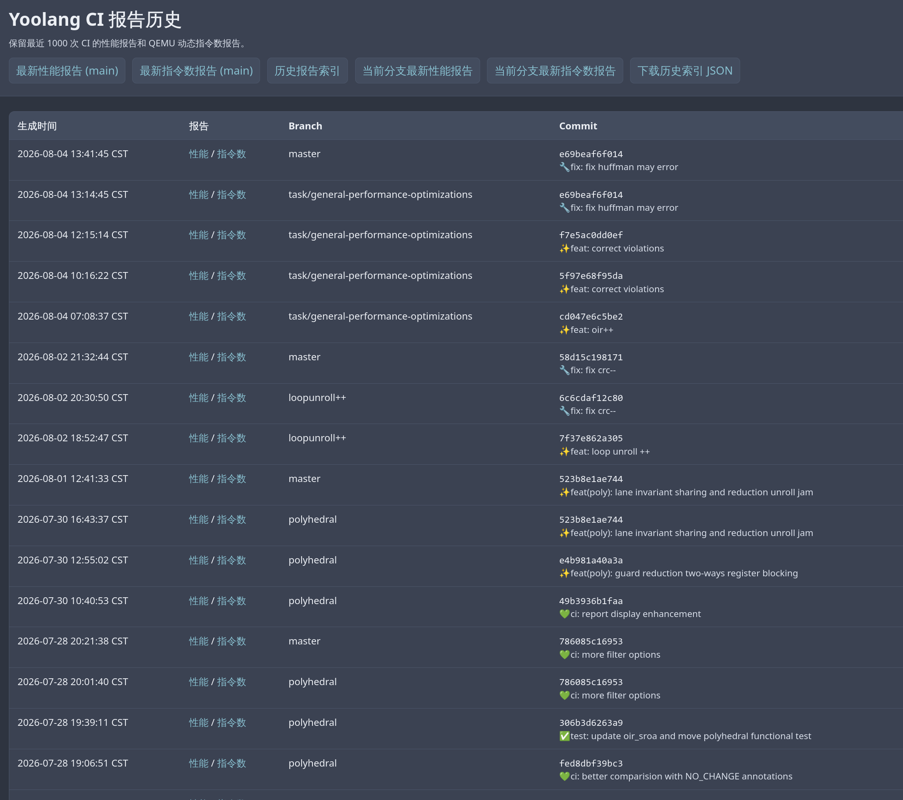

# yoolang 编译器设计

yoolang 是一个使用 C++17 编写的 SysY 编译器，面向 RV64GC/LP64D 平台。编译器采用自研的
AST、YIR、OIR 和 MIR，将源语言结构逐步转换为 RISC-V 汇编，并在 `-O1` 模式下完成从
多面体循环变换、SSA 优化到寄存器分配的完整优化流程。

## 1. 设计目标

- 通过分层 IR 保存不同阶段最有价值的信息：YIR 保存结构化循环，OIR 表达 SSA/CFG，MIR
  表达目标指令和寄存器约束。
- 在能够证明语义等价的前提下尽早优化，并通过代价模型控制代码膨胀、寄存器压力和编译开销。
- 面向 RV64GC 生成稳定、可汇编链接的代码，遵循 LP64D 调用约定和 16 字节栈对齐要求。
- 以 IR 验证和端到端测试保障正确性，以动态指令统计和性能基线评估优化效果。

## 2. 系统架构



默认模式采用较直接的栈槽式代码生成：

```text
Lexer / Parser -> AST Semantic Analysis -> ASTToYIR
  -> YIRToOIR -> OIRToMIR (stack-slot) -> MIRToAsm
```

`-O1` 模式的主流水线为：

```text
ASTSemanticAnalysis -> ASTToYIR
  -> YIRView -> YIRPolyhedralPipeline (Auto) -> YIRMemoryForwarding
  -> YIRLoopOptimization -> YIRLoopAnalysis -> YIRToOIR
  -> OIROptimizationPipeline -> OIRToMIR (virtual registers)
  -> MIRCombine -> MIRPreRAPeephole -> MIRPreRAListScheduler
  -> MIRRegAlloc -> MIRPostRAPeephole -> MIRPostRAListScheduler
  -> MIRToAsm
```

PassManager 顺序执行各阶段，并通过统一上下文传递 IR、分析结果和优化报告。
普通 `-O1` 只对具有收益候选的函数运行多面体流水线；`--polyhedral` 可强制进入建模流程，但
不会跳过依赖与合法性检查。

## 3. 模块划分

| 模块 | 职责 | 关键设计 |
| --- | --- | --- |
| 前端 | 词法、语法和语义分析 | 递归下降解析、符号表、源级类型与作用域检查 |
| YIR | 保存结构化控制流和数组信息 | Region/Operation、多面体模型、循环与访存优化 |
| OIR | 表达 SSA 与显式 CFG | Phi、use-def、支配、别名、MemorySSA 和过程间分析 |
| MIR 与后端 | 面向 RISC-V 完成代码生成 | 指令选择、调度、图着色寄存器分配和栈帧布局 |
| 合法性与代价模型 | 判断变换能否执行以及是否有收益 | 结构/依赖证明、QF_BV、成本与风险评估 |
| Runtime | 提供 SysY 运行接口 | 整数/浮点输入输出、数组接口和计时函数 |
| 测试与持续集成 | 验证正确性与性能 | IR 测试、QEMU 端到端执行、基线比较和报告发布 |

### 3.1 多面体优化模块

yoolang 在 YIR 层实现轻量级多面体优化。系统首先规范循环边界、步长和归纳变量，识别控制流
与数组访问可分析的静态控制区域（SCoP），再以 statement 为单位建立迭代域、仿射访问关系和
公共调度空间。仿射模型支持常量除法、取模和组合仿射表达式。

依赖分析覆盖数组 RAW、WAR 和 WAW，通过距离向量、GCD 检验和 Presburger 关系判断调度
是否合法。结构变换后会重新建立 SCoP、访问模型和依赖关系，保证后续优化使用有效信息。

多面体变换包括循环融合、循环交换、分块、访存转发、归约私有化、输出维展开合并和语句域
划分。代价模型综合评估循环开销、访存局部性、代码增长和寄存器压力。

### 3.2 持续集成与性能分析模块

持续集成流水线完成 release 构建、YIR/OIR/MIR/ASM 分阶段验证、RISC-V 静态链接和 QEMU
端到端测试，并使用统一输入和运行库比较 yoolang、GCC、Clang 及 main 分支基线。系统同时
记录运行时间、动态/静态指令数和 MIR 阶段指标，自动生成并发布 Markdown、JSON 和 HTML
报告。

CI 完成后会发布状态与性能摘要，并将每次性能和指令数报告写入可追溯的历史索引。





## 4. 中间表示设计

| 层级 | 核心结构 | 主要信息 | 主要用途 |
| --- | --- | --- | --- |
| AST | 声明、表达式和语句树 | 源语言作用域、类型和语法结构 | 语义分析与高层转换 |
| YIR | `Module → Function → Region → Operation` | `If/While/For`、数组维度和结构化循环 | 多面体、循环和数组优化 |
| OIR | `Module → Function → BasicBlock → Instruction` | SSA use-def、显式 CFG、Phi 和内存操作 | 标量、内存、循环和过程间优化 |
| MIR | `Module → MachineFunction → MachineBasicBlock → MachineInstr` | RISC-V 指令、虚拟/物理寄存器和栈槽 | 机器级优化、调度和寄存器分配 |
| ASM | GNU RISC-V 汇编文本 | section、label、伪指令和 ABI 序列 | 汇编、链接与执行 |

下面以 `sum_to(n)` 中“从 0 累加到 n-1”的循环为例。三个代码块均为当前编译器输出的
核心节选，省略了 Module、Function 外壳和参数搬运。

### 4.1 YIR

YIR 使用 Region 表达嵌套控制流。`IfOp` 拥有 then/else Region，`WhileOp` 拥有条件和循环体，
`ForOp` 显式保存归纳变量、上下界和步长。数组操作保留元素类型、维度和索引信息，使循环和
访存优化无需从低层地址计算中恢复源程序结构。

```ir
yir.while {
  ^cond:
    %v2 = yir.icmp lt %i, %n : i1
    yir.cond %v2
  ^body:
    %v3 = yir.addi %sum, %i : i32
    yir.assign %sum, %v3
    %v4 = yir.const.i32 1 : i32
    %v5 = yir.addi %i, %v4 : i32
    yir.assign %i, %v5
}
```

### 4.2 OIR

OIR 是自研的 typed SSA/CFG IR，包含基本块、Phi、GEP、Load、Store、Call、Branch、Return
和 `MemZeroInst`。分析框架提供支配树、自然循环、标量演化、别名分析、函数 Mod/Ref 和
MemorySSA，为循环与内存变换提供依据。

```oir
while.cond.1:
  %sum.loop = phi [0, %entry.0], [%v3, %while.body.2]
  %i.loop = phi [0, %entry.0], [%v5, %while.body.2]
  %v2 = icmp lt i32 %i.loop, %n.arg
  br i1 %v2, %while.body.2, %while.end.3
while.body.2:
  %v3 = add i32 %sum.loop, %i.loop
  %v5 = add i32 %i.loop, 1
  br %while.cond.1
while.end.3:
  ret i32 %sum.loop
```

### 4.3 MIR 与 ABI

MIR 固定面向 `riscv64/lp64d`，区分 GPR、FPR32、虚拟寄存器和物理寄存器。整数参数使用
`a0-a7`，浮点参数使用 `fa0-fa7`，返回值使用 `a0/fa0`，其余参数通过栈传递。

```text
while.cond.1:
  SLT %v3:gpr, %v2:gpr, %v0:gpr
  BNEZ %v3:gpr, %while.body.2
  J %while.end.3

while.body.2:
  ADDW %v4:gpr, %v1:gpr, %v2:gpr
  ADDIW %v5:gpr, %v2:gpr, 1
  MV %v1:gpr, %v4:gpr
  MV %v2:gpr, %v5:gpr
  J %while.cond.1
```

此时 OIR 的 Phi 已降为前驱边上的复制，平台无关算术也已选择为 RV64 的 `ADDW/ADDIW`
等机器指令。

栈帧依次包含 outgoing arguments、局部对象与 spill、callee-saved 寄存器和返回地址，并按
16 字节对齐。

## 5. 优化策略

### 5.1 YIR：结构化与多面体优化

YIR 优化依次完成数组视图消除、多面体建模与变换、结构化访存转发、循环优化和循环分析。

- **循环结构优化**：循环不变量外提、归约折叠、循环交换、二维分块、展开合并和小循环完全展开。
- **访存优化**：数组视图消除、Store-to-Load 转发、Stencil carry 和仿射公共子表达式消除。
- **多面体变换**：循环融合、Band 交换/分块、归约私有化、输出维 2/4 路展开合并和语句域划分。

所有会改变迭代顺序的变换都必须通过依赖关系和调度合法性检查；结构变化后重新分析依赖。

### 5.2 OIR：SSA、内存与过程间优化

OIR 优化先进行循环和 CFG 规范化，再执行常量参数特化与内联，随后通过最多八轮有界迭代
收敛标量、内存和循环变换，最后统一清理无效代码与参数。

- **标量与 CFG**：常量折叠、代数化简、SCCP、值域传播、分支化简、if-conversion、GVN、
  Jump Threading、DCE 和 ADCE。
- **内存优化**：SROA、Mem2Reg、全局常量传播、全局 Load 提升、Load/Store 消除和
  MemorySSA 驱动的转发。
- **循环优化**：循环规范化、LICM、GEP 强度削弱、边界收紧、旋转、Unswitch、完全展开、
  仿射取模递推折叠和清零循环识别。
- **过程间优化**：函数内联、常量参数特化、只读调用复用、尾递归消除和无用参数删除。

### 5.3 MIR：目标相关优化与代码生成

MIR 在寄存器分配前完成立即数、地址模式、比较分支、位运算惯用法、复制、CSE、LICM 和
指针循环退出优化；列表调度器根据寄存器依赖、关键路径和指令延迟重排局部指令。

寄存器分配器分别处理 GPR 和 FPR32，基于活跃性建立冲突图，以复制关系提供颜色偏好，并对
跨 Call 活跃值限制 caller-saved 寄存器。发生 Spill 时插入栈槽 Load/Store；常量、全局地址和
栈地址可以重物化。分配完成后再运行 PostRA 清理与调度，最终输出 GNU RISC-V 汇编。

## 6. 合法性证明与代价模型

优化始终先检查结构、类型、别名和依赖关系，必要时使用 QF_BV 位向量求解器证明整数表达式
等价；只有证明成功的变换才会执行，反例、超时或无法证明时保持原程序不变。

代价模型统计指令、代码大小、访存、分支、调用、活跃值、Spill 和编译开销，并评估代码膨胀、
寄存器压力与局部性风险。它主要用于内联、循环融合/交换/分块/展开、if-conversion、机器 CSE、
LICM 和指令调度等收益不确定的变换。

## 7. 正确性保障

- 在 AST→YIR、YIR 多面体变换、YIR→OIR、OIR 优化、OIR→MIR 和寄存器分配等关键边界执行
  对应 IR 验证。
- stage 测试检查 YIR、OIR、MIR 和 ASM；e2e 测试通过 RISC-V 静态链接和 QEMU 执行检查
  程序输出与退出状态。
- FileCheck 和多面体测试检查稳定的 IR 结构；性能测试综合运行时间、动态指令数、静态指令
  分布和 main 分支基线。

## 附录：Pass 清单

主优化流程由聚合 Pipeline Pass 编排。Dump 与 Diagnostics Pass 按输出选项启用；
`YIRLoopCanonicalizePass` 和 `YIRLoopCountPass` 提供独立的辅助分析能力。

### A.1 前端与 YIR

| Pass | 作用 |
| --- | --- |
| `ASTDumpPass` | 输出 AST |
| `ASTSemanticAnalysisPass` | 建立符号表并完成语义检查 |
| `ASTToYIRPass` | 将源程序转换为结构化 YIR |
| `YIRViewPass` | 消除临时数组视图并重写仿射索引 |
| `YIRPolyhedralCanonicalizePass`, `YIRSCoPDetectPass` | 规范循环并识别静态控制区域 |
| `YIRPolyhedralModelBuildPass`, `YIRPolyhedralDependenceAnalysisPass` | 构建迭代域、访问、调度和依赖关系 |
| `YIRPolyhedralTransformPass`, `YIRPolyhedralPipelinePass` | 执行并编排多面体变换与重分析 |
| `YIRPolyhedralDumpPass` | 输出多面体模型 |
| `YIRMemoryForwardingPass` | 执行结构化 Store-to-Load 转发 |
| `YIRLoopOptimizationPass`, `YIRLoopAnalysisPass` | 优化循环并分析循环层次、迭代次数和访存 |
| `YIRLoopCanonicalizePass`, `YIRLoopCountPass` | 提供循环规范化和结构统计能力 |
| `YIRToOIRPass` | 将结构化 YIR 降为 OIR SSA/CFG |

### A.2 OIR

| Pass | 作用 |
| --- | --- |
| `OIROptimizationPipelinePass` | 编排 OIR 优化窗口和有界固定点迭代 |
| `OIRConstantFoldPass`, `OIRAlgebraicSimplifyPass`, `OIRSCCPPass` | 常量传播、代数化简和稀疏条件常量传播 |
| `OIRCFGCleanupPass`, `OIRJumpThreadingPass` | 规范 CFG、删除不可达块并穿透已知分支 |
| `OIRDeadCodeEliminationPass`, `OIRADCEPass`, `OIRDAEPass` | 删除无效计算和未使用形参 |
| `OIRSROAPass`, `OIRMem2RegPass` | 拆分聚合对象并将局部标量提升到 SSA |
| `OIRGlobalOptPass`, `OIRGVNPass` | 优化全局值并消除公共子表达式 |
| `OIRDeadLoadEliminationPass`, `OIRDeadStoreEliminationPass` | 删除冗余或不可观察的内存访问 |
| `OIRLoopCanonicalizePass`, `OIRLICMPass`, `OIRLoopStrengthReductionPass` | 规范循环、外提不变量并优化地址递推 |
| `OIRInlinePass`, `OIRTailRecursionEliminationPass` | 内联函数并消除尾递归 |
| `OIRToMIRPass` | 完成 RISC-V 指令选择、调用约定和 Phi 并行复制 |

### A.3 MIR 与公共诊断

| Pass | 作用 |
| --- | --- |
| `MIRCombinePipelinePass`, `MIRImmediateCombinePass`, `MIRAddressModeCombinePass` | 编排指令合并，折叠立即数和地址模式 |
| `MIRCompareBranchCombinePass`, `MIRRemZeroBranchCombinePass`, `MIRBitIdiomCombinePass` | 融合分支并化简取余和位运算惯用法 |
| `MIRCombineDeadDefEliminationPass` | 删除无使用的 PreRA 纯定义 |
| `MIRPeepholePipelinePass`, `MIRCopyCoalescingPass`, `MIRBranchFusionPass` | 编排窥孔优化、复制合并和比较分支融合 |
| `MIRLocalCSEPass`, `MIRAddressOffsetFoldPass`, `MIRJumpCleanupPass` | 消除机器公共子表达式，折叠地址并清理跳转 |
| `MIRBlockSimplifyPass`, `MIRPeepholeDeadDefEliminationPass` | 化简基本块并删除 PreRA/PostRA 无用定义 |
| `MIRListSchedulerPass` | 基于依赖和延迟进行局部列表调度 |
| `MIRRegAllocPass` | 图着色寄存器分配、Spill、重物化和栈帧布局 |
| `MIRDiagnosticsPass` | 记录机器阶段指标 |
| `MIRToAsmPass` | 输出 GNU RISC-V 汇编 |
| `CostModelDiagnosticsPass` | 输出代价模型候选与决策报告 |
